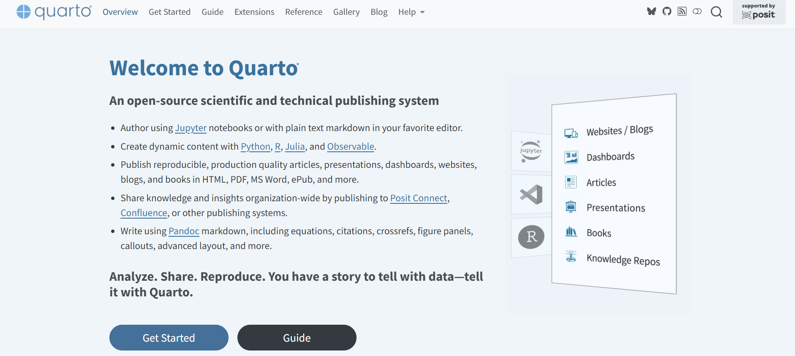
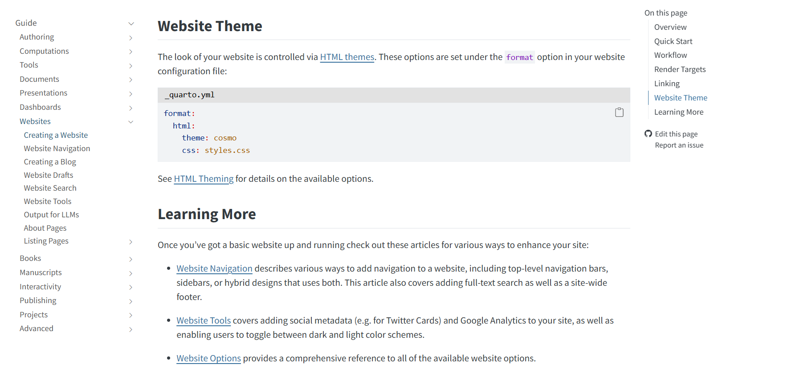
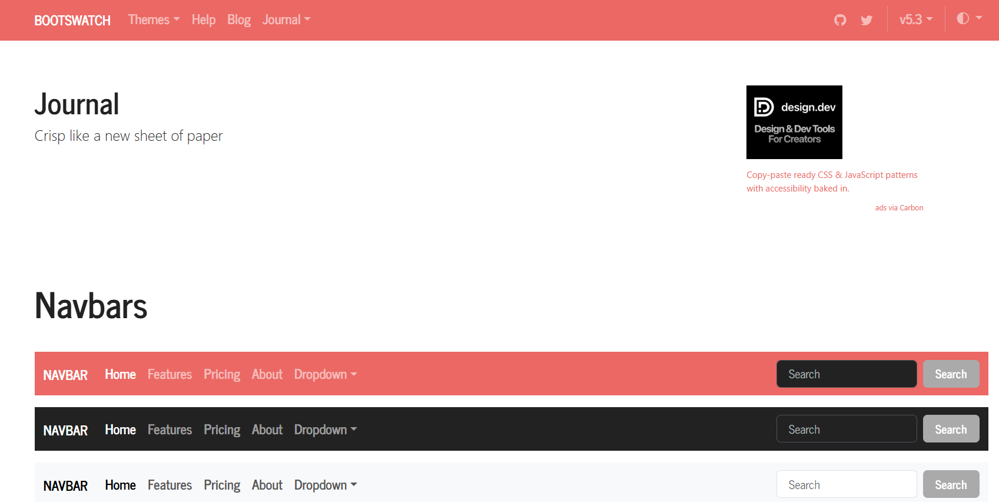
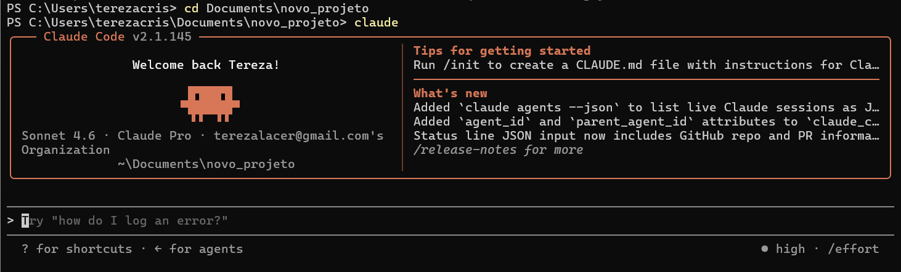

Olá!

Acabei de ter uma ideia: criar um blog para documentar todos os meus estudos futuros envolvendo ciência de dados, IA e tudo mais que vier na cabeça. A ideia é que seja um **laboratório aberto de experimentações** — aprender na prática e documentar tudo. E quem sabe, ajudar quem também está começando :)

Então nada mais justo do que o primeiro post documentar... a criação do próprio blog. Vamos lá.

## Por que o Quarto?

Eu já tenho alguma experiência com blogs usando o [Quarto](https://quarto.org/) — uma ferramenta da Posit (antiga RStudio) para criar relatórios, sites, apresentações, artigos, etc. O "antepassado" dele é o próprio RMarkdown. Sim, eu usava muito R (saudades, inclusive).

O Quarto é muito legal, principalmente porque integra bem com várias linguagens: R, Python, Julia. Como esse projeto vai ser feito em **Python** — para variar e aprender coisas novas — ele encaixou perfeitamente. Meu outro blog é todo em R, então Python já é uma novidade por si só. Vamos ver no que dá.

## Escolhendo o tema

A parte mais difícil: escolher a estética. Eu *gosto muito* de estética kkkkk.

O Quarto tem suporte a temas do [Bootswatch](https://quarto.org/docs/output-formats/html-themes.html), e cada tema tem uma página de preview mostrando botões, tipografia, cores — praticamente todos os elementos. Ótimo para quem é visual como eu.

Depois de um bom tempo olhando (não vou mentir), escolhi o **Journal**.

"Crisp like a new sheet of paper." — vendi. Gosto da ideia de estar escrevendo em papel. E o header em salmon ficou lindo.

## A instalação — onde o Claude Code entrou

Com o tema escolhido, era hora de instalar as ferramentas e criar o blog de fato. Foi aí que resolvi testar o **Claude Code** — a CLI da Anthropic que roda direto no terminal — para ver se ele conseguiria fazer todo o setup por mim.

Spoiler: ele fez tudo mesmo kkkkkk

Em uma sessão, o Claude:

- Verificou o que já estava instalado (Python 3.14 ✓, Quarto ✗, VS Code ✗)
- Instalou o **Quarto 1.9.37** e o **VS Code** via `winget`
- Instalou as extensões `quarto.quarto` e `ms-python.python` no VS Code
- Instalou o **Jupyter** (necessário para rodar Python nos posts)
- Criou o projeto do blog com `quarto create project blog`
- Configurou o tema Journal no `_quarto.yml`
- Rodou o `quarto preview` para confirmar que tudo funcionava

Tudo isso com eu descrevendo o que queria em linguagem natural, sem precisar ficar pesquisando comandos. Achei bem impressionante — e pretendo usar bastante ao longo do projeto, documentando o que funciona e o que não funciona.

## GitHub

Antes de encerrar o dia, conectei o projeto a um repositório no GitHub:

👉 [github.com/terezalacerda/laboratorio-aberto](https://github.com/terezalacerda/laboratorio-aberto)

Também via Claude Code — ele criou o repo, configurou o `.gitignore` e fez o primeiro push. Levou menos de um minuto.

## E agora?

A ideia é ir postando à medida que for estudando e experimentando. Sem compromisso de frequência, sem pressão. Só documentar o que estiver fazendo.

Se você também está começando e achou isso útil — ou se tiver dicas — fico feliz em saber :)

Até o próximo!
